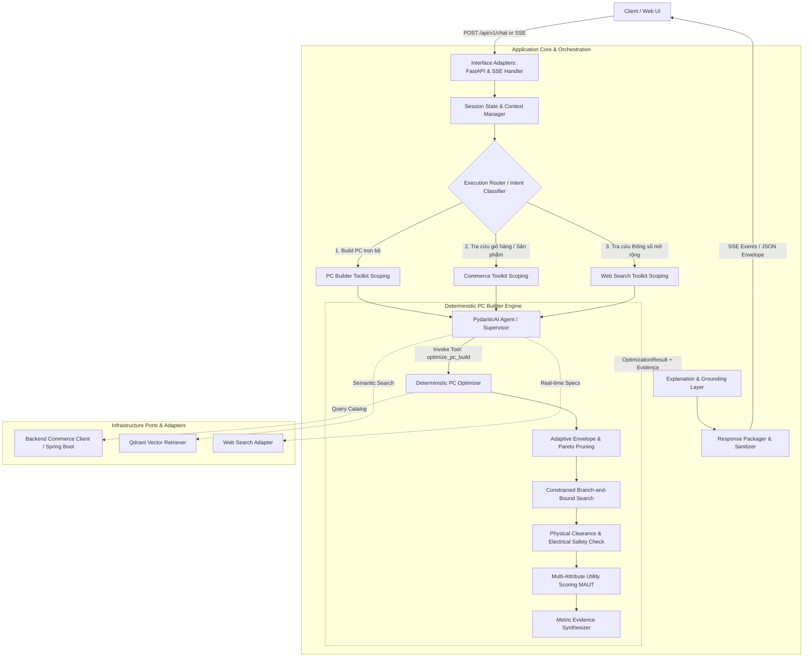

# Kiến trúc Kỹ thuật (Technical Architecture) — AI Service

Tài liệu này mô tả chi tiết kiến trúc tổng thể, luồng xử lý dữ liệu (data flow), phân ranh giới trách nhiệm (separation of concerns), và các module của dịch vụ **Python AI Service (`ai-service`)** thuộc hệ thống Trợ lý Mua sắm & Xây dựng Cấu hình PC (`pc-shopping-assistant-org`).

---

## 1. Triết lý Thiết kế Cốt lõi (Core Principles)

Dịch vụ AI Service được thiết kế theo 4 nguyên tắc kỹ thuật bất biến:

1. **Deterministic Core vs Probabilistic Agent (Phân tách Rõ Ràng):**
   - Không cho phép LLM tính toán số học, tự chọn linh kiện, hoặc tự đoán tương thích vật lý.
   - LLM chỉ chịu trách nhiệm: **Requirement Extraction** (trích xuất yêu cầu khách hàng thành cấu trúc) và **Natural Language Explanation** (giải thích build dựa trên số liệu thực tế `MetricEvidence`).
   - Việc sinh cấu hình, kiểm tra cơ học/điện năng, tối ưu đa mục tiêu (MAUT) do **Deterministic Engine** thuần toán học thực thi độc lập:
     > *"A Multiple-Choice Knapsack Problem with Pairwise Compatibility Constraints, solved using deterministic constrained search with Pareto pruning."*

2. **Clean Architecture (Hexagonal / Ports & Adapters):**
   - Tầng nghiệp vụ cốt lõi (`application/` và `capabilities/`) không phụ thuộc trực tiếp vào framework mạng (FastAPI), cơ sở dữ liệu vector (Qdrant), hay SDK nhà cung cấp mô hình (Google GenAI, OpenAI).
   - Mọi giao tiếp ra ngoài đều thông qua các **Outbound Ports** trừu tượng (`application/ports/`).

3. **Dynamic Tool Scoping (Giảm Nhiễu cho LLM):**
   - Thay vì cấp hàng chục công cụ vào một Agent duy nhất (gây loãng ngữ cảnh và gọi nhầm tool), hệ thống dùng **Intent Router** để phân loại ý định người dùng và chỉ nạp bộ công cụ chuyên biệt (Domain Specialist Toolkit) tương ứng cho lượt hội thoại đó.

4. **Streaming First & Standard API Contract:**
   - Hỗ trợ Server-Sent Events (SSE) để truyền token và trạng thái thực thi theo thời gian thực tới giao diện người dùng.
   - Mọi response API JSON đều tuân thủ chặt chẽ cấu trúc phong bì chuẩn của dự án:
     ```json
     {
       "data": {},
       "message": "STATIC_MESSAGE_KEY",
       "errors": []
     }
     ```

---

## 2. Sơ đồ Luồng Xử lý Tổng thể (End-to-End Pipeline)



---

## 3. Cấu trúc Thư mục và Phân vùng Trách nhiệm

```text
ai-service/
├── src/ai_service/
│   ├── api/                           # Interface Adapters (Tầng giao tiếp ngoài)
│   │   ├── dependencies.py            # FastAPI dependency injection
│   │   ├── routers/                   # HTTP & SSE endpoints (/api/v1/assistant, /pc-builder)
│   │   └── sse/                       # SSE streaming protocol serializer
│   ├── application/                   # Application Core (Tầng nghiệp vụ & Hợp đồng)
│   │   ├── use_cases/                 # Orchestration use cases (AssistantUseCase)
│   │   ├── ports/                     # Abstract interfaces (Hardware, Commerce, Search, Retriever)
│   │   └── errors.py                  # Domain-specific exceptions
│   ├── capabilities/                  # Feature Vertical Slices (Các tính năng độc lập)
│   │   ├── pc_builder/                # Bộ engine xây dựng PC chuẩn xác
│   │   │   ├── schemas.py             # Core Domain Models (forbid) & Tool Schemas (ignore)
│   │   │   ├── pruning.py             # Adaptive Envelopes & Profile-aware Pareto Dominance
│   │   │   ├── optimizer.py           # Core Optimizer (Search, Power, Clearance, Scoring)
│   │   │   └── tools.py               # Tool wrappers cho Agent/Graph
│   │   ├── shopping_assistant/        # Bộ công cụ tra cứu giá, giỏ hàng, chính sách
│   │   │   ├── schemas.py
│   │   │   └── tools.py
│   │   └── web_search/                # Bộ công cụ tra cứu thông số sâu từ web
│   │       ├── schemas.py
│   │       └── tools.py
│   └── infrastructure/                # Tầng triển khai Adapter thực tế
│       ├── composition.py             # Composition Root (Khởi tạo toàn bộ dependency)
│       ├── commerce/                  # Client gọi Spring Boot Backend qua REST
│       ├── hardware/                  # Rule engine cơ sở và tra cứu benchmark
│       └── retrieval/                 # Adapter kết nối Qdrant Vector Store
├── tests/                             # Test Suite toàn diện
│   ├── test_pc_optimizer.py           # 45 Property-based & Invariant tests cho Core Optimizer
│   ├── test_pc_builder_tools.py       # Integration tests cho PC builder tools
│   ├── test_shopping_assistant_tools.py
│   └── test_web_search.py
├── DECISIONS.md                       # Architecture Decision Records (ADR)
├── ARCHITECTURE.md                    # Tài liệu kiến trúc kỹ thuật
├── SOLUTION.md                        # Đặc tả Giải pháp Kỹ thuật Toàn diện
├── KNOWLEDGE.md                       # Tổng mục Cơ sở tri thức phần cứng (3-Tier Master Index)
└── knowledge/                         # 3 Tầng quản trị tri thức phần cứng
    ├── 01-physical-ground-truth.md    # Tầng 1: Bất biến Vật lý & Tiêu chuẩn Phần cứng
    ├── 02-engineering-policies.md     # Tầng 2: Chính sách Kỹ thuật Điện & Nguồn
    └── 03-optimization-policies.md    # Tầng 3: Chính sách Tối ưu hóa & MAUT
```

---

## 4. Chi tiết các Tầng Kiến trúc (Component Deep-Dive)

### 4.1. Tầng Giao diện (Interface Adapters — `src/ai_service/api/`)

- **FastAPI Endpoints:** Đón nhận request tại `/api/v1/assistant/chat` và `/api/v1/pc-builder/optimize`.
- **SSE Streamer:** Chuyển đổi các sự kiện nội bộ của Agent thành luồng SSE:
  - `event: token`: Các đoạn văn bản giải thích đang được sinh ra.
  - `event: tool_call`: Tên công cụ và tham số Agent đang thực thi.
  - `event: build_result`: Cấu hình hoàn chỉnh kèm `MetricEvidence` dạng JSON.
  - `event: error`: Thông báo lỗi được ánh xạ theo key ổn định.
- **Phong bì chuẩn API:** Ánh xạ dữ liệu trả về theo format `{data, message, errors}`. Tuyệt đối không trả về raw prose trong trường `message`.

### 4.2. Tầng Quản lý Phiên & Phân luồng (Session State & Router)

- **Structured Session State:** Lưu giữ trạng thái hội thoại khách hàng, bao gồm:
  - `target_budget_vnd`: Ngân sách mục tiêu kèm `ConstraintSource` và cờ `locked`.
  - `use_case`: Nhu cầu chính (ví dụ `GAMING_1440P`, `AI_DATA_SCIENCE`).
  - `owned_parts`: Các linh kiện khách đã có sẵn (không cộng giá vào ngân sách).
  - `locked_preferences`: Các hãng hoặc kích cỡ khách bắt buộc giữ (ví dụ chỉ chọn card NVIDIA).
- **Execution Router (Dynamic Tool Scoper):**
  - Đọc intent của người dùng từ câu chat gần nhất kết hợp session state.
  - Phân loại thành: `BUILD_FULL_PC`, `CHECK_COMPATIBILITY`, `UPGRADE_ADVICE`, `PRODUCT_QUERY`, hoặc `GENERAL_CHAT`.
  - Cung cấp chính xác tập công cụ chuyên biệt cho Agent, tránh việc LLM bị quá tải công cụ không liên quan.

### 4.3. Tầng Tối ưu Hóa Xác Định (Deterministic PC Builder Engine)

Nằm trọn vẹn trong `src/ai_service/capabilities/pc_builder/`:

1. **Adaptive Envelopes & Pareto Pruning (`pruning.py`):**
   - Phân bổ ngân sách vào từng nhóm linh kiện dựa trên `UseCaseProfile` (ví dụ Gaming 1440p ưu tiên GPU 35–55%).
   - Pareto Dominance đa chiều theo từng mục tiêu (`PERFORMANCE`, `BALANCED`, `UPGRADE_FRIENDLY`).
   - Bảo toàn khả thi: Không bao giờ prune linh kiện nếu thiếu thông số (`fail-safe`), không loại bỏ các socket khác nhau, giữ nguyên `all_affordable` để duyệt toàn diện.

2. **Core Combinatorial Optimizer (`optimizer.py`):**
   - Tổ hợp các linh kiện từ Catalog đã qua sàng lọc.
   - Sắp xếp ưu tiên ứng viên trong preferred envelope, dùng kỹ thuật nhánh cận (branch-and-bound) để cắt tỉa các nhánh vượt quá ngân sách.
   - Tính toán công suất tức thời & đột biến (Transient Spikes) để xác định công suất nguồn tối thiểu và khuyến nghị.
   - **Xác thực tương thích nghiêm ngặt:** Chỉ chấp nhận `CompatibilityStatus.COMPATIBLE`. Mọi trường hợp thiếu dữ liệu clearance/power đều trả về `UNKNOWN` và bị loại bỏ.
   - **Chấm điểm MAUT (Multi-Attribute Utility Theory):** Chuẩn hóa điểm số từng chiều về thang $[0.0, 100.0]$. Nếu một chiều có trọng số $>0$ mà thiếu dữ liệu $\to$ trả về `-1.0` (Invalidated).
   - **Deterministic Tie-Breaking:** Kết quả được ổn định tuyệt đối bằng khóa tuple `(-score, total_price, fingerprint)`.

3. **Core Domain Schemas (`schemas.py`):**
   - Tuân thủ `CORE_CONFIG = ConfigDict(extra="forbid")` chống lỗi chính tả.
   - `RankedBuild` chỉ chứa số liệu thực tế `MetricEvidence`, không chứa văn bản cảm tính.
   - `OptimizationResult` thuần túy trả về từ điển `builds: dict[BuildObjective, RankedBuild]`.

### 4.4. Tầng Diễn giải & Kiểm soát Ảo giác (Explanation & Grounding Layer)

- Nhận `OptimizationResult` từ Core.
- Áp dụng **Recommendation Policy**: Lựa chọn cấu hình phù hợp nhất với người dùng (mặc định là `BuildObjective.BALANCED` hoặc objective người dùng chỉ định).
- Cung cấp danh sách `MetricEvidence` (ví dụ: `VRAM: 12GB`, `FPS ước tính: 95 FPS`, `PSU Headroom: 150W`) cho LLM.
- **System Prompt Guardrail:** Ép buộc LLM chỉ được phát ngôn dựa trên các bằng chứng có trong `MetricEvidence`, cấm tự bịa các tính năng không có số liệu chứng minh.

### 4.5. Tầng Hạ tầng & Thành phần Kết nối (Infrastructure Adapters)

- **`BackendCommerceClient`:** Gọi REST API của backend Spring Boot để lấy danh mục linh kiện còn hàng, giá hiện hành, thông tin khuyến mãi.
- **`LocalHardwareRuleEngine`:** Cung cấp thông số cơ sở (clearance tiêu chuẩn, socket hierarchy, benchmark mapping tĩnh khi database chưa đồng bộ).
- **`QdrantRetriever`:** Truy vấn vector ngữ nghĩa khi người dùng hỏi các câu hỏi chung về kiến thức phần cứng hoặc chính sách bảo hành.
- **`CompositionRoot` (`composition.py`):** Điểm duy nhất khởi tạo process-scoped dependencies, bảo đảm tính độc lập của Use Case và dễ dàng mock khi chạy unit/property tests.

---

## 5. Đảm bảo Chất lượng & Tiêu chuẩn Kiểm thử (Quality Gates)

Mọi thay đổi trong `ai-service` phải vượt qua 4 chốt chặn trước khi bàn giao:

```bash
# 1. Chạy toàn bộ test suite (Bao gồm 30 property tests của Core Optimizer)
UV_CACHE_DIR=/tmp/pc-shopping-uv-cache uv run pytest -q

# 2. Kiểm tra linter và style code
UV_CACHE_DIR=/tmp/pc-shopping-uv-cache uv run ruff check src tests

# 3. Kiểm tra kiểu tĩnh nghiêm ngặt (Strict Static Type Checking)
UV_CACHE_DIR=/tmp/pc-shopping-uv-cache uv run mypy src

# 4. Kiểm tra khóa phụ thuộc
UV_CACHE_DIR=/tmp/pc-shopping-uv-cache uv lock --check
```

### Các Bất Biến Kiểm Thử (Tested Invariants):

1. **Determinism:** Cùng catalog + cùng constraints $\to$ Cùng cấu hình đầu ra.
2. **Order Invariance:** Shuffle catalog với bất kỳ seed nào $\to$ Cùng nghiệm tối ưu.
3. **Pareto Safety:** Pruning BẬT hay TẮT đều cho ra đúng nghiệm tối ưu toàn cục.
4. **Zero Fabrication:** CPU không có iGPU/Cooler $\to$ Tuyệt đối không sinh cấu hình ảo.
5. **No Metric Guessing:** Thiếu dữ liệu của metric có trọng số $\to$ Đánh dấu build không hợp lệ (`score = -1.0`).
6. **No Undersized PSU:** Nhu cầu $> 1200\text{W} \to$ Ném ngoại lệ, không hạ thấp công suất.
